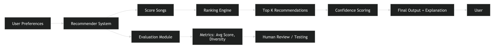
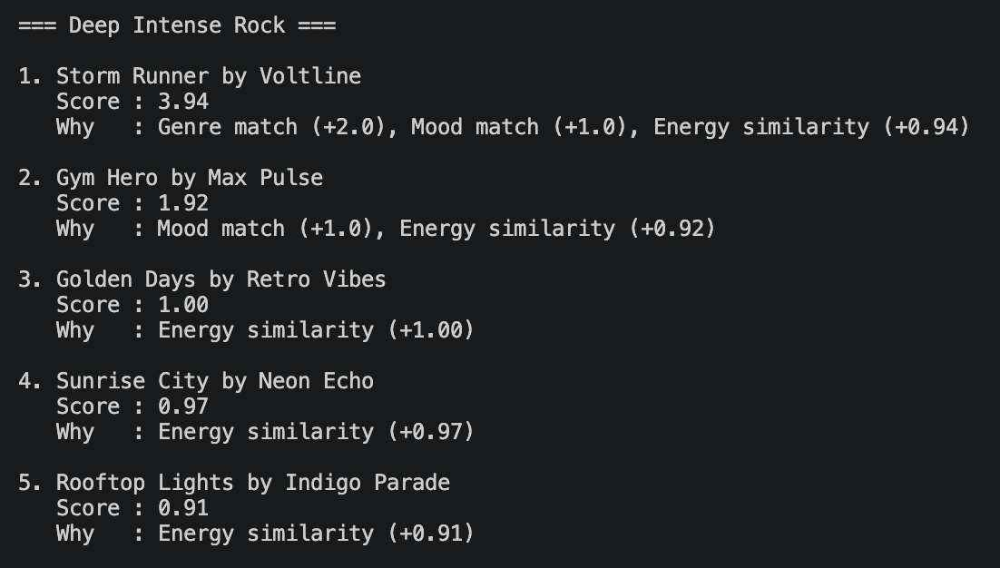
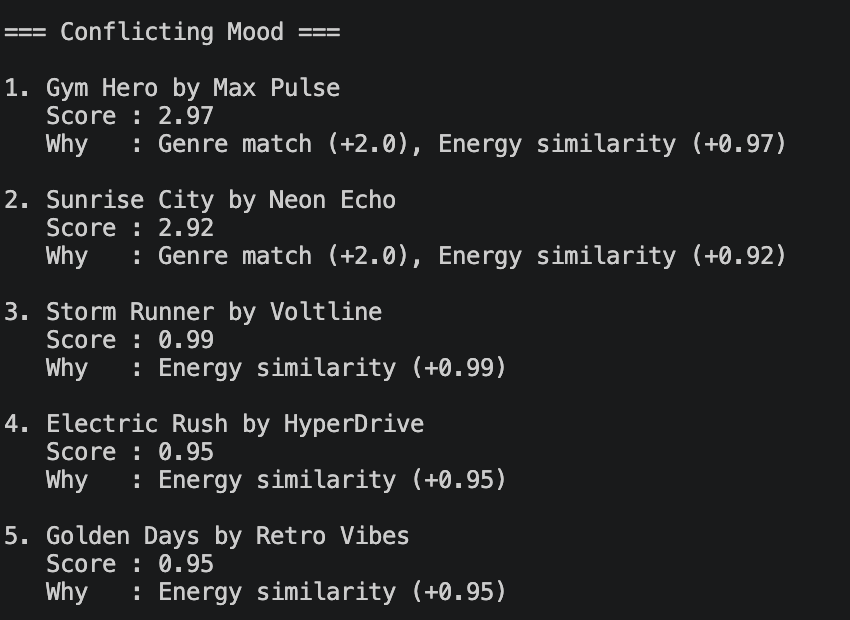
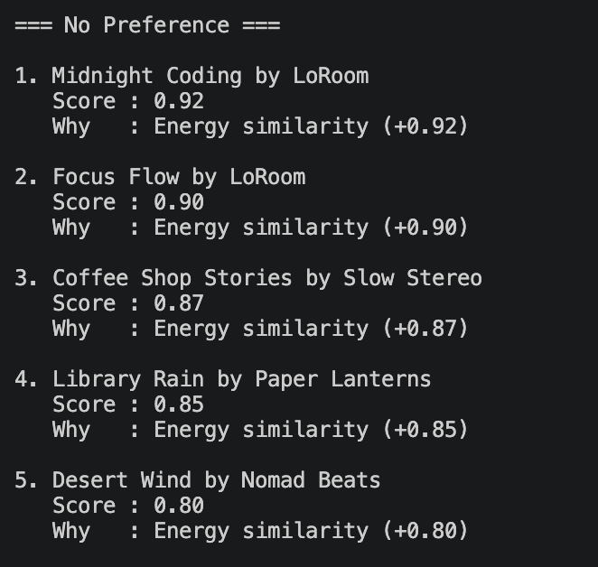
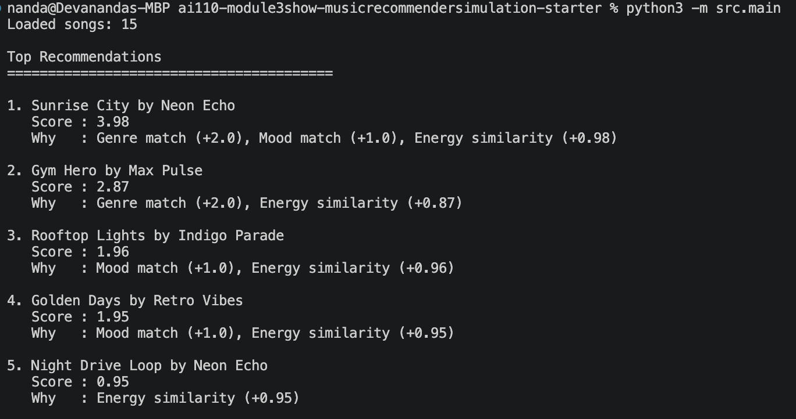
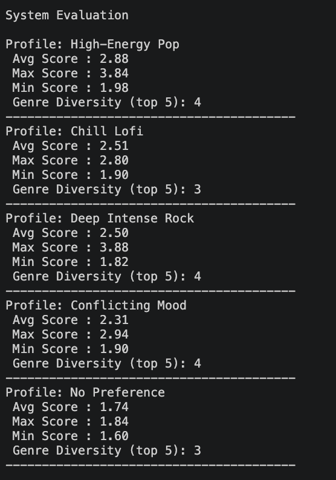
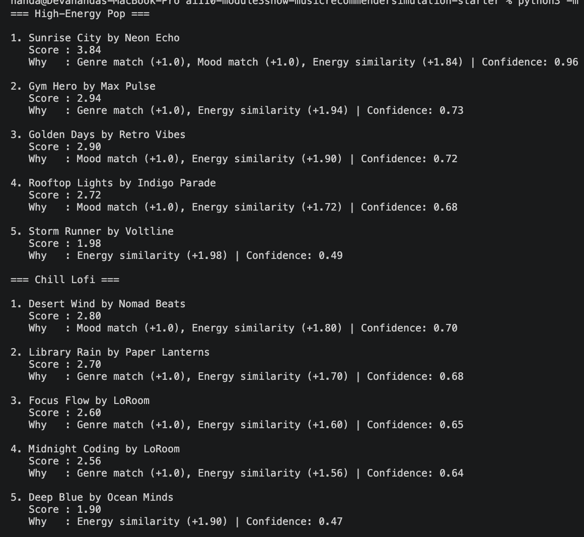
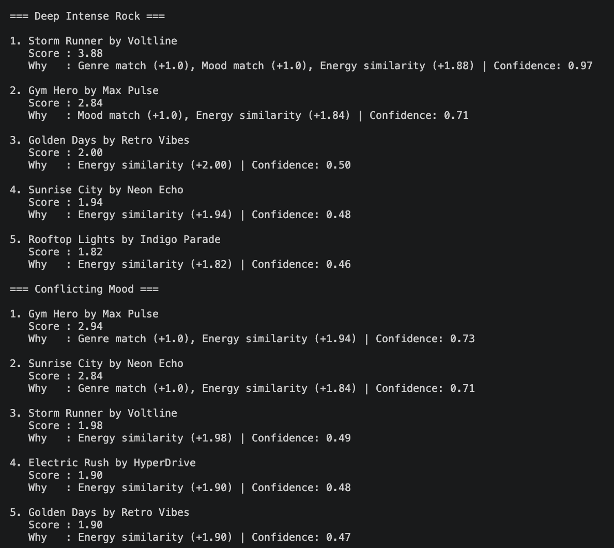
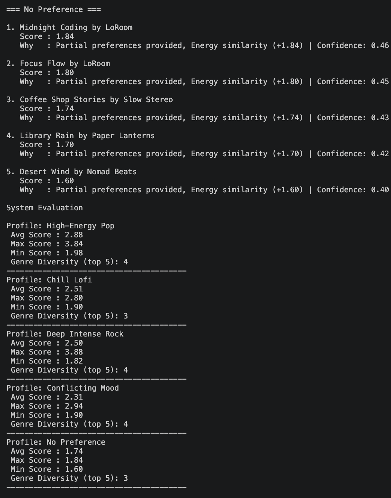
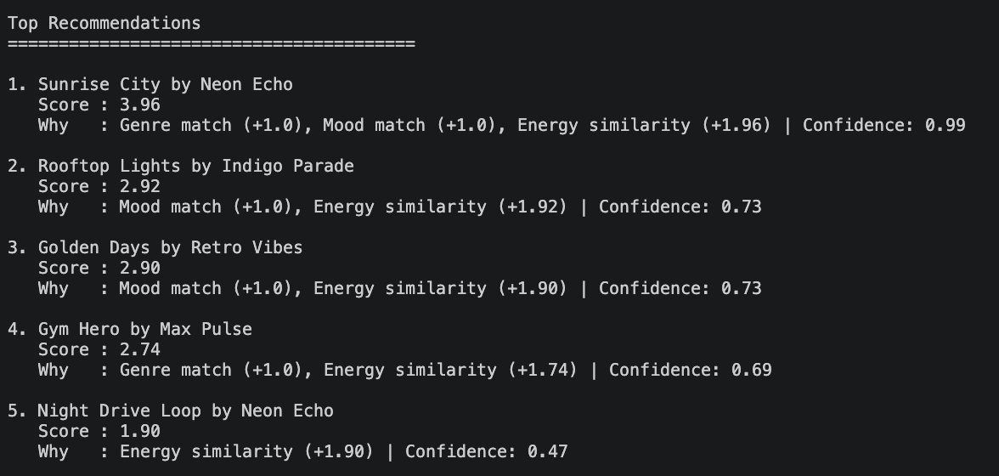

# 🎵 Music Recommender Simulation

## Project Summary

In this project you will build and explain a small music recommender system.

Your goal is to:

- Represent songs and a user "taste profile" as data
- Design a scoring rule that turns that data into recommendations
- Evaluate what your system gets right and wrong
- Reflect on how this mirrors real world AI recommenders

This project builds a simple content-based music recommender system. It takes a user’s preferences like genre, mood, and energy level, and compares them with a dataset of songs. Each song is given a score based on how closely it matches the user’s taste, and the system recommends the highest scoring songs. The goal is to simulate how real-world platforms like Spotify suggest music using structured data and ranking logic.

## Demo Video

Watch the full system walkthrough here:  
https://www.loom.com/share/6540fad032f34d23a31af6bae7b683ce

## Applied AI System Extension

This project builds on my earlier Module 3-4 project: "Music Recommender Simulation".

The original version implemented a basic content-based recommender that scored songs using genre, mood, and energy. It generated ranked recommendations but did not include evaluation, confidence scoring, or system-level reliability testing.
In this extended version, the system has been improved with:

- A structured evaluation module to test reliability across multiple user profiles
- Confidence scoring
- Guardrails to handle incomplete or invalid user inputs
- A modular architecture separating recommendation, evaluation, and output layers

These improvements improves the project from a simple simulation into a more advanced AI system.

## System Architecture

The system is designed as a modular pipeline where user preferences flow through multiple components.

1. The recommender scores each song based on user preferences
2. A ranking module selects the top K results
3. A confidence layer evaluates how strong each recommendation is
4. An evaluation module tests system performance across multiple profiles

This design ensures separation of concerns and makes the system easier to test and extend.



---

## How The System Works

This recommender system uses a **content-based filtering approach**, meaning it recommends songs by comparing song features directly with a user’s preferences.

### Features Used

Each song contains:
- Genre (e.g., pop, rock, lofi)
- Mood (e.g., happy, sad, chill)
- Energy (a value between 0.0 and 1.0)
- Tempo (beats per minute)

The user profile includes:
- Preferred genre
- Preferred mood
- Target energy level

### Scoring Logic

Each song is given a score based on:

- +1.0 point if the genre matches the user’s preference
- +1.0 point if the mood matches
- + 2 × (1 - energy difference) to strongly reward songs with similar energy levels

Songs closer to the user’s energy preference receive higher scores. Because of the increased weight, energy similarity plays the biggest role in ranking songs.

### Recommendation Process

1. The system loads all songs from the dataset
2. Each song is scored individually using the scoring logic
3. Songs are sorted from highest to lowest score
4. The top K songs are recommended to the user

### Potential Bias

This system may over-prioritize genre and repeatedly recommend similar songs, creating a “filter bubble.” It may also ignore good matches in mood or energy if the genre does not match.

### System Flow


### User Profile Design

The user profile is defined as:

- Genre: pop  
- Mood: happy  
- Energy: 0.8  

This profile represents a user who prefers upbeat, energetic music.

This combination allows the system to differentiate between different styles. For example:
- "Intense rock" songs may match energy but not genre
- "Chill lofi" songs may match mood but not energy

Because multiple features are used together, the recommender can distinguish between different types of music rather than treating all songs as similar.

---

## Getting Started

### Setup

1. Create a virtual environment (optional but recommended):

   ```bash
   python -m venv .venv
   source .venv/bin/activate      # Mac or Linux
   .venv\Scripts\activate         # Windows

2. Install dependencies

```bash
pip install -r requirements.txt
```

3. Run the app:

```bash
python -m src.main
```

### Running Tests

Run the starter tests with:

```bash
pytest
```

You can add more tests in `tests/test_recommender.py`.

---

## Experiments You Tried

### Weight Shift Experiment

I changed the scoring by reducing the genre weight from 2.0 to 1.0 and doubling the energy similarity.

After running the system again, I noticed that energy had a much bigger impact on the rankings. Songs with similar energy levels started appearing higher even if the genre did not match.

Because of this, the recommendations became more diverse, but sometimes less accurate for users with strong genre preferences. For example, some songs ranked high mainly because of energy similarity, even though they did not match the genre.

This shows that increasing energy weight makes the system more flexible, but reducing genre weight can reduce precision.

### System Evaluation

I tested the recommender system using multiple user profiles, including both normal and edge cases:

- High-Energy Pop (clear strong preferences)
- Chill Lofi (low energy, relaxed mood)
- Deep Intense Rock (high energy, intense mood)
- Conflicting Mood (high energy + sad mood)
- No Preference (no genre or mood specified)

#### Observations

- The system performs well when user preferences are clear and aligned (e.g., High-Energy Pop).
- In conflicting cases, the system ignores mismatches and only rewards matches, which can lead to less accurate recommendations.
- When no preferences are provided, the system relies mostly on energy similarity, resulting in more generic recommendations.
- The model does not penalize incorrect matches, which limits its ability to distinguish poor fits.

## Design Decisions

I chose a content-based recommender because it is simple, interpretable, and works well with small datasets.

I prioritized energy similarity over genre to increase flexibility and allow more diverse recommendations. However, this introduced a trade-off: while recommendations became more varied, they were sometimes less accurate for users with strong genre preferences.

I also added a separate evaluation module instead of embedding evaluation inside the recommender. This keeps the system modular and easier to extend, but adds an extra layer of complexity.

#### Accuracy and Surprises

For the "High-Energy Pop" profile, the recommendations felt accurate because the top songs matched both genre and energy closely. Songs like "Sunrise City" ranked highly because of strong alignment with all features.

One surprise was that in some cases, songs with only energy similarity still ranked in the top 5. This shows that energy plays a strong role even when genre or mood do not match.

Additionally, the same songs appeared across multiple profiles, which shows that the dataset is small and that certain features (like energy similarity) dominate the scoring.

After asking Claude why "Sunrise City" ranked #1 for the High-Energy Pop profile, it answered that this happened because it matched all the important features. The genre is pop, which matches the user preference, so it gets +2.0. The mood is also happy, which matches again and adds +1.0. On top of that, the energy level (0.82) is very close to the user’s preference (0.9), so it gets a high energy similarity score of +0.92.

Because of this, its total score becomes 3.92, which is higher than all the other songs.

Other songs didn’t match as well. For example, "Gym Hero" matches the genre and has similar energy, but its mood is different, because of which it doesn’t get the extra +1.0. That is why its total score is lower (2.97).

So overall, songs that match all features clearly rank higher, which is why "Sunrise City" comes out on top.


#### Example Outputs

Screenshots of terminal outputs for each profile are included below:

  
  
  
  
  


## CLI Output Example

Here is an example of the recommender system running in the terminal:




# APPLIED SYSTEM UPDATES


## Reliability & Evaluation

I added a small evaluation step to check how well the recommender works.

The system runs multiple user profiles and looks at:
- Average score of recommendations  
- Highest and lowest scores  
- How many different genres appear in the top results  

This helps me see if the system is working properly for different types of users or if it keeps giving similar results.



### Testing Summary

The system was tested across 5 different user profiles, including edge cases such as conflicting preferences and missing inputs.

The recommender performed well when user preferences were clear, producing high-confidence and relevant recommendations. Confidence scores typically ranged between 0.7 and 0.95 for strong matches.

However, performance dropped in edge cases. When preferences were missing or conflicting, the system relied heavily on energy similarity, resulting in less personalized recommendations.

After adding guardrails and confidence scoring, the system became more stable and interpretable, even when inputs were incomplete.

## Confidence and Guardrails

I added a confidence score to show how strong each recommendation is.

The confidence is calculated using:

confidence = score / max_possible_score

This helps understand how well a song actually matches the user’s preferences, instead of just looking at the raw score.

I also added some basic guardrails to make the system more reliable. For example:
- If the user doesn’t give a genre or mood, the system still works and mentions that preferences are incomplete
- If the energy value is invalid, it resets it to a default value (0.5)

These changes make sure the system doesn’t break and still gives reasonable recommendations even when the input is not perfect.






---

## Limitations and Risks

This system has a few limitations. The dataset is very small, so the same songs can appear a lot of times and the recommendations aren't very diverse.

The scoring also gives more importance to energy, which can cause songs with similar energy to rank high even if the genre or mood doesn't really match well.

So because of this, the system may not give accurate or fair recommendations for all types of users.

---

## Reflection

Working on this project helped me understand how recommender systems turn user preferences into scores and rankings. I learned that even a simple system can make reasonable recommendations by comparing features like genre, mood, and energy. It also showed me how important it is to choose the right weights, because small changes can completely change the results.

I also saw how bias can appear in the system. For example, giving too much importance to energy caused the same songs to show up for different users. The small dataset also limited variety and made the system less fair for users with different tastes. This made me realize that real-world systems need more data and better balancing to avoid repeating results and to give more personalized recommendations.


---

## 7. `model_card_template.md`

```markdown
# 🎧 Model Card - Music Recommender Simulation

## 1. Model Name

MusicMatch 1.0

---

## 2. Intended Use

This system recommends songs based on a user’s preferred genre, mood, and energy level. It tries to find songs that are most similar to the user’s taste.


---

## 3. How It Works (Short Explanation)

The system looks at three main things: genre, mood, and energy.

Each song has these features, and the user also gives their preferred genre, mood, and energy level.

The system compares each song to the user’s preferences. If the genre matches, it adds some points. If the mood matches, it adds more points. Then it checks how close the energy level is, and gives a higher score if it is very similar.

Finally, it adds all these points together to get a total score for each song. Songs with higher scores are recommended first.


---

## 4. Data

The dataset contains about 15 songs stored in `data/songs.csv`.

I added about 5 songs to the dataset

The songs include a mix of genres like pop, rock, lofi, ambient, jazz, edm, synthwave, disco, and world. The moods include happy, chill, intense, relaxed, calm, focused, moody, peaceful, and energetic.

Overall, the dataset feels small and mostly reflects general modern music tastes, especially more popular or common styles.
---

## 5. Strengths

The recommender works well when the user has clear preferences. For example, the High-Energy Pop profile gave songs that were both energetic and matched the genre, which felt accurate.

It also works well for profiles like Chill Lofi, where the system was able to return calm and low-energy songs that match the vibe.

Another strength is that the system is simple and easy to understand. The scoring is transparent, so it is clear why each song is recommended based on genre, mood, and energy.

---

## 6. Limitations and Bias

The system is biased toward energy because energy has the biggest weight in the scoring. Because of this, songs with similar energy keep showing up even if the genre or mood does not match well.

Also, some users are not handled properly. For example, if a user chooses a mood like "sad" but there are no songs with that mood in the dataset, then the system just ignores mood completely.

Another issue is that the dataset is very small, so the same songs appear again and again. This creates a filter bubble where users don’t get much variety in recommendations.

---

## 7. Evaluation

I tested the system using different user profiles like High-Energy Pop, Chill Lofi, Deep Intense Rock, Conflicting Mood, and No Preference.

I noticed that when the preferences are clear, the results look correct. For example, High-Energy Pop gives songs that are upbeat and energetic.

One surprising thing was that some songs showed up in multiple profiles. This happens because energy has a strong influence, so songs with similar energy keep ranking high even if other features don’t match.

Also, when the user has no preference or conflicting preferences, the system mostly depends on energy, which makes the recommendations less meaningful.

---

## 8. Future Work

If I had more time, I would improve the recommender in a few ways.

First, I would add more songs to the dataset so the system can give more diverse recommendations.

Second, I would balance the scoring weights so that energy does not dominate too much and genre and mood also have a stronger impact.

Third, I would improve mood matching so similar words (like sad and moody) can still match instead of requiring exact words.

---

## 9. Personal Reflection

Building this system showed me how small changes in scoring can have a big impact on results. I was surprised that energy had such a strong effect, and that the same songs kept appearing across different profiles.

This made me realize that real music recommenders are more complex and need to balance multiple factors carefully to avoid repeating the same content.

I also learned that human judgment still really matters because the system cannot fully understand emotions or context. For example, it cannot truly understand what someone means by "sad" or "relaxing" unless it is clearly defined in the data.