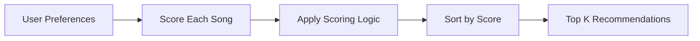

# 🎵 Music Recommender Simulation

## Project Summary

In this project you will build and explain a small music recommender system.

Your goal is to:

- Represent songs and a user "taste profile" as data
- Design a scoring rule that turns that data into recommendations
- Evaluate what your system gets right and wrong
- Reflect on how this mirrors real world AI recommenders

This project builds a simple content-based music recommender system. It takes a user’s preferences like genre, mood, and energy level, and compares them with a dataset of songs. Each song is given a score based on how closely it matches the user’s taste, and the system recommends the highest scoring songs. The goal is to simulate how real-world platforms like Spotify suggest music using structured data and ranking logic.

---

## How The System Works

This recommender system uses a **content-based filtering approach**, meaning it recommends songs by comparing song features directly with a user’s preferences.

### Features Used

Each song contains:
- Genre (e.g., pop, rock, lofi)
- Mood (e.g., happy, sad, chill)
- Energy (a value between 0.0 and 1.0)
- Tempo (beats per minute)

The user profile includes:
- Preferred genre
- Preferred mood
- Target energy level

### Scoring Logic

Each song is given a score based on:

- +2.0 points if the genre matches the user’s preference
- +1.0 point if the mood matches
- + (1 - energy difference) to reward songs with similar energy levels

Songs closer to the user’s energy preference receive higher scores.
Energy similarity is calculated as (1 - absolute difference).

### Recommendation Process

1. The system loads all songs from the dataset
2. Each song is scored individually using the scoring logic
3. Songs are sorted from highest to lowest score
4. The top K songs are recommended to the user

### Potential Bias

This system may over-prioritize genre and repeatedly recommend similar songs, creating a “filter bubble.” It may also ignore good matches in mood or energy if the genre does not match.

### System Flow



### User Profile Design

The user profile is defined as:

- Genre: pop  
- Mood: happy  
- Energy: 0.8  

This profile represents a user who prefers upbeat, energetic music.

This combination allows the system to differentiate between different styles. For example:
- "Intense rock" songs may match energy but not genre
- "Chill lofi" songs may match mood but not energy

Because multiple features are used together, the recommender can distinguish between different types of music rather than treating all songs as similar.

---

## Getting Started

### Setup

1. Create a virtual environment (optional but recommended):

   ```bash
   python -m venv .venv
   source .venv/bin/activate      # Mac or Linux
   .venv\Scripts\activate         # Windows

2. Install dependencies

```bash
pip install -r requirements.txt
```

3. Run the app:

```bash
python -m src.main
```

### Running Tests

Run the starter tests with:

```bash
pytest
```

You can add more tests in `tests/test_recommender.py`.

---

## Experiments You Tried

Use this section to document the experiments you ran. For example:

- What happened when you changed the weight on genre from 2.0 to 0.5
- What happened when you added tempo or valence to the score
- How did your system behave for different types of users

---

## Limitations and Risks

Summarize some limitations of your recommender.

Examples:

- It only works on a tiny catalog
- It does not understand lyrics or language
- It might over favor one genre or mood

You will go deeper on this in your model card.

---

## Reflection

Read and complete `model_card.md`:

[**Model Card**](model_card.md)

Write 1 to 2 paragraphs here about what you learned:

- about how recommenders turn data into predictions
- about where bias or unfairness could show up in systems like this


---

## 7. `model_card_template.md`

Combines reflection and model card framing from the Module 3 guidance. :contentReference[oaicite:2]{index=2}  

```markdown
# 🎧 Model Card - Music Recommender Simulation

## 1. Model Name

Give your recommender a name, for example:

> VibeFinder 1.0

---

## 2. Intended Use

- What is this system trying to do
- Who is it for

Example:

> This model suggests 3 to 5 songs from a small catalog based on a user's preferred genre, mood, and energy level. It is for classroom exploration only, not for real users.

---

## 3. How It Works (Short Explanation)

Describe your scoring logic in plain language.

- What features of each song does it consider
- What information about the user does it use
- How does it turn those into a number

Try to avoid code in this section, treat it like an explanation to a non programmer.


## CLI Output Example

Here is an example of the recommender system running in the terminal:


---

## 4. Data

Describe your dataset.

- How many songs are in `data/songs.csv`
- Did you add or remove any songs
- What kinds of genres or moods are represented
- Whose taste does this data mostly reflect

---

## 5. Strengths

Where does your recommender work well

You can think about:
- Situations where the top results "felt right"
- Particular user profiles it served well
- Simplicity or transparency benefits

---

## 6. Limitations and Bias

Where does your recommender struggle

Some prompts:
- Does it ignore some genres or moods
- Does it treat all users as if they have the same taste shape
- Is it biased toward high energy or one genre by default
- How could this be unfair if used in a real product

---

## 7. Evaluation

How did you check your system

Examples:
- You tried multiple user profiles and wrote down whether the results matched your expectations
- You compared your simulation to what a real app like Spotify or YouTube tends to recommend
- You wrote tests for your scoring logic

You do not need a numeric metric, but if you used one, explain what it measures.

---

## 8. Future Work

If you had more time, how would you improve this recommender

Examples:

- Add support for multiple users and "group vibe" recommendations
- Balance diversity of songs instead of always picking the closest match
- Use more features, like tempo ranges or lyric themes

---

## 9. Personal Reflection

A few sentences about what you learned:

- What surprised you about how your system behaved
- How did building this change how you think about real music recommenders
- Where do you think human judgment still matters, even if the model seems "smart"

